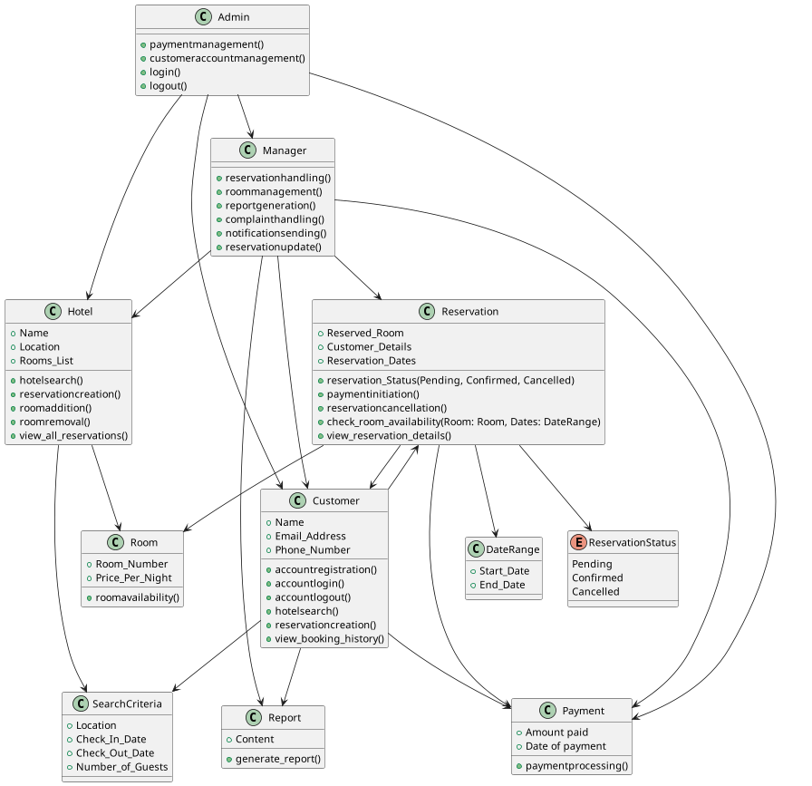
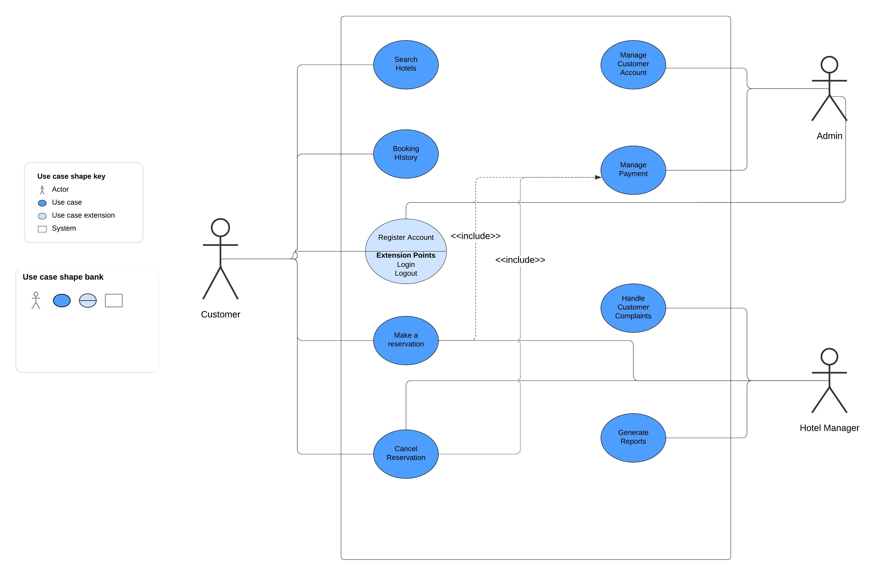
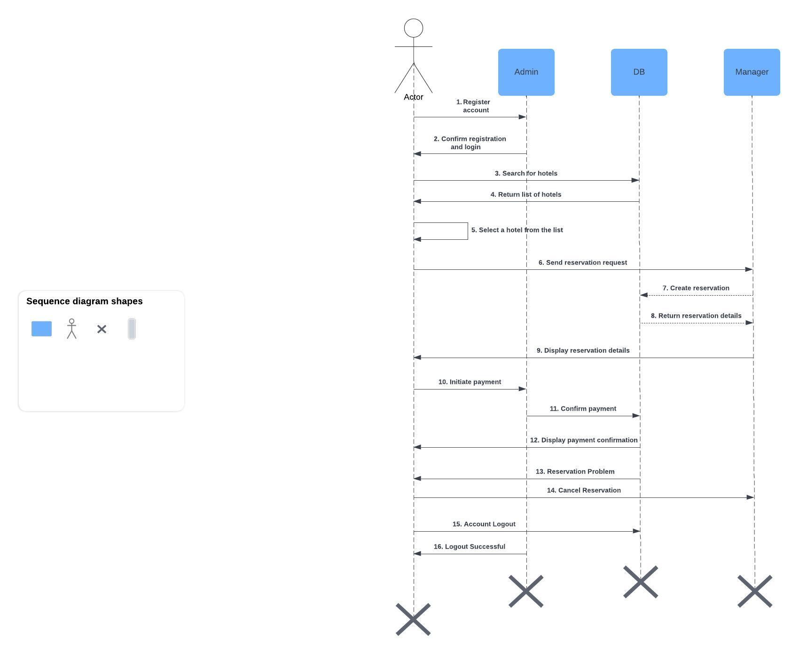

# Software Requirements Specification (SRS)
# Hotel Reservation System

## Team Information

- **Team Leader:** 
_Jyotika Jayani (Roll No. 22052987)_
- **Members:**
  - _Harshit Ghosh (Roll No. 22052982)_
  - _Shreya (Roll No. 22051024)_
## 1. Introduction

### 1.1 Purpose
The purpose of this document is to provide a detailed Software Requirements Specification (SRS) for the Hotel Reservation System. This system is designed to manage hotel reservations, room availability, payments, and customer interactions. The SRS outlines the functionalities, interfaces, and performance criteria of the system.

### 1.2 Scope
The Hotel Reservation System is intended to be a comprehensive solution for managing hotel operations, including room management, customer reservations, payment processing, and reporting. The system will be used by administrators, hotel managers, and customers to facilitate the entire booking process from room search to payment.

### 1.3 Definitions, Acronyms, and Abbreviations
- **SRS**: Software Requirements Specification
- **UML**: Unified Modeling Language
- **Admin**: Administrator of the hotel system
- **Manager**: Hotel Manager responsible for daily operations
- **Customer**: End user who makes reservations

### 1.4 References
- UML Class Diagram for the Hotel Reservation System
- IEEE Std 830-1998 - IEEE Recommended Practice for Software Requirements Specifications

### 1.5 Overview
This SRS document is organized into the following sections:
- **Overall Description**: Describes the system’s general functionality and user interactions.
- **System Features**: Details the specific functionalities of the system.
- **External Interface Requirements**: Describes the interfaces with which the system will interact.
- **System Attributes**: Discusses the non-functional requirements, such as performance and security.

## 2. Overall Description

### 2.1 Product Perspective
The Hotel Reservation System is an independent software solution designed to manage the operations of a hotel. It interfaces with users via a web-based application, providing functionalities such as hotel search, reservation creation, room management, payment processing, and reporting.

The system components, as shown in the UML class diagram, include classes for `Hotel`, `Room`, `Customer`, `Reservation`, `Payment`, `Admin`, `Manager`, `SearchCriteria`, `DateRange`, and `Report`.

### 2.2 Product Functions
The primary functions of the system include:
- **Hotel Management**: Admin and Managers can add or remove rooms, view all reservations, and manage the overall hotel operations.
- **Reservation Handling**: Customers can search for available hotels, make reservations, and view their booking history.
- **Payment Processing**: The system handles payment transactions, including initiation and processing.
- **Reporting**: Managers can generate reports based on various criteria to analyze hotel performance.

### 2.3 User Classes and Characteristics
- **Admin**: Has full control over the system, including user management, payment processing, and hotel management.
- **Manager**: Manages hotel operations, handles reservations, and generates reports.
- **Customer**: Can search for hotels, make reservations, and manage their bookings.

### 2.4 Operating Environment
The Hotel Reservation System will operate in a web-based environment, accessible via standard web browsers (e.g., Chrome, Firefox, Safari). The system will be hosted on a cloud-based server with a relational database backend.

### 2.5 Design and Implementation Constraints
- The system must be scalable to handle multiple hotels and a large number of customers simultaneously.
- It must comply with data protection regulations, including GDPR for customer data.

### 2.6 Assumptions and Dependencies
- The system assumes a reliable internet connection for accessing the web application.
- Integration with third-party payment gateways will be required for processing payments.

## 3. System Features

### 3.1 Hotel Management

#### 3.1.1 Description
This feature allows Admins and Managers to manage hotel information, including adding or removing rooms, viewing reservations, and updating hotel details.

#### 3.1.2 Functional Requirements
- **FR1**: The system shall allow Admins to add new rooms to the hotel.
- **FR2**: The system shall allow Admins to remove existing rooms from the hotel.
- **FR3**: The system shall allow Managers to view all reservations associated with the hotel.
- **FR4**: The system shall allow Managers to update hotel information, including Name and Location.

### 3.2 Room Management

#### 3.2.1 Description
This feature provides functionalities for checking room availability, managing room details, and updating room status.

#### 3.2.2 Functional Requirements
- **FR1**: The system shall allow Managers to check the availability of rooms for specific dates.
- **FR2**: The system shall allow Admins to update room details, including Room Number and Price Per Night.

### 3.3 Customer Reservation

#### 3.3.1 Description
Customers can search for hotels based on specific criteria, create reservations, and view their booking history.

#### 3.3.2 Functional Requirements
- **FR1**: The system shall allow Customers to search for hotels based on location, check-in date, check-out date, and number of guests.
- **FR2**: The system shall allow Customers to create a reservation for an available room.
- **FR3**: The system shall allow Customers to view their past reservations and booking history.

### 3.4 Payment Processing

#### 3.4.1 Description
This feature handles the initiation and processing of payments related to hotel reservations.

#### 3.4.2 Functional Requirements
- **FR1**: The system shall allow Customers to initiate payment after reservation creation.
- **FR2**: The system shall process payments and update the payment status in the Reservation.

### 3.5 Reporting

#### 3.5.1 Description
Managers can generate reports based on various criteria, such as reservation status, room availability, and financial transactions.

#### 3.5.2 Functional Requirements
- **FR1**: The system shall allow Managers to generate reports detailing reservations within a specific date range.
- **FR2**: The system shall allow Managers to generate financial reports based on payments received.

## 4. External Interface Requirements

### 4.1 User Interfaces
- **Admin Interface**: A web-based dashboard allowing full control over hotel operations, user management, and payments.
- **Manager Interface**: A web-based interface for handling daily hotel operations, generating reports, and managing reservations.
- **Customer Interface**: A web-based interface for searching hotels, making reservations, and managing personal bookings.

### 4.2 Hardware Interfaces
The system does not require any specific hardware interfaces. It will be hosted on cloud servers and accessed via standard web browsers.

### 4.3 Software Interfaces
- **Payment Gateway**: The system will integrate with third-party payment gateways (e.g., Stripe, PayPal) for processing transactions.
- **Database**: The system will use a relational database (e.g., MySQL, PostgreSQL) for storing all data related to hotels, reservations, and payments.

### 4.4 Communication Interfaces
- **HTTP/HTTPS**: The system will communicate with clients and external services using HTTP/HTTPS protocols.
- **RESTful APIs**: The system will expose and consume RESTful APIs for interactions with external systems, such as payment gateways.

## 5. System Attributes

### 5.1 Performance
- The system shall be able to handle up to 10,000 concurrent users without performance degradation.
- The response time for searching hotels shall be less than 2 seconds under normal load conditions.

### 5.2 Security
- The system shall require user authentication for Admins, Managers, and Customers.
- All sensitive data, including payment information, shall be encrypted in transit and at rest.
- The system shall log all user activities for auditing purposes.

### 5.3 Maintainability
- The system shall be designed with modular components to facilitate easy updates and maintenance.
- The codebase shall follow industry-standard practices, including the use of version control and automated testing.

### 5.4 Portability
- The system shall be deployable on any cloud platform supporting standard web technologies (e.g., AWS, Azure, Google Cloud).
- The system shall be compatible with all major web browsers.

## 6. Other Requirements

### 6.1 Legal and Regulatory Requirements
- The system must comply with GDPR regulations for handling customer data.
- Payment processing must adhere to PCI DSS standards.

### 6.2 Safety Requirements
- There are no specific safety requirements for this system.

## 7. Appendices

### 7.1 Class Diagram
The following class diagram from the UML model illustrates the relationships and attributes of the system’s components. This diagram provides a structural view of the Hotel Reservation System, showing the classes involved, their properties, methods, and how they interact with one another.

### 7.2 Use Case Diagram
The use case diagram below illustrates the interactions between users (actors) and the system. It identifies the primary use cases, such as searching for hotels, making reservations, and managing accounts, and shows how different actors, like customers, managers, and administrators, interact with these use cases.

### 7.3 Sequence Diagram
The sequence diagram presents a dynamic view of the system by showing how objects interact in a particular scenario of a use case. It emphasizes the order of messages exchanged between objects during the execution of the process, such as during the reservation creation or payment processing.

### 7.4 Glossary
This glossary provides definitions for terms used throughout the Software Requirements Specification (SRS) document:

- **Actor:** A user or system that interacts with the Hotel Reservation System.
- **Admin:** The system administrator responsible for managing user accounts, payments, and overall system settings.
- **Class Diagram:** A UML diagram that represents the static structure of the system by showing its classes, their attributes, and relationships.
- **Customer:** A user of the system who can search for hotels, make reservations, and manage their account.
- **Manager:** A user responsible for handling reservations, managing rooms, and generating reports.
- **Reservation:** The process of booking a room in a hotel, including details like room number, customer details, and reservation dates.
- **Use Case Diagram:** A UML diagram that depicts the functional requirements of the system by showing interactions between users and use cases.
- **Sequence Diagram:** A UML diagram that shows how objects interact in a particular scenario, highlighting the sequence of messages between them.
- **Payment:** The process of handling financial transactions within the system, including payment initiation and processing.
